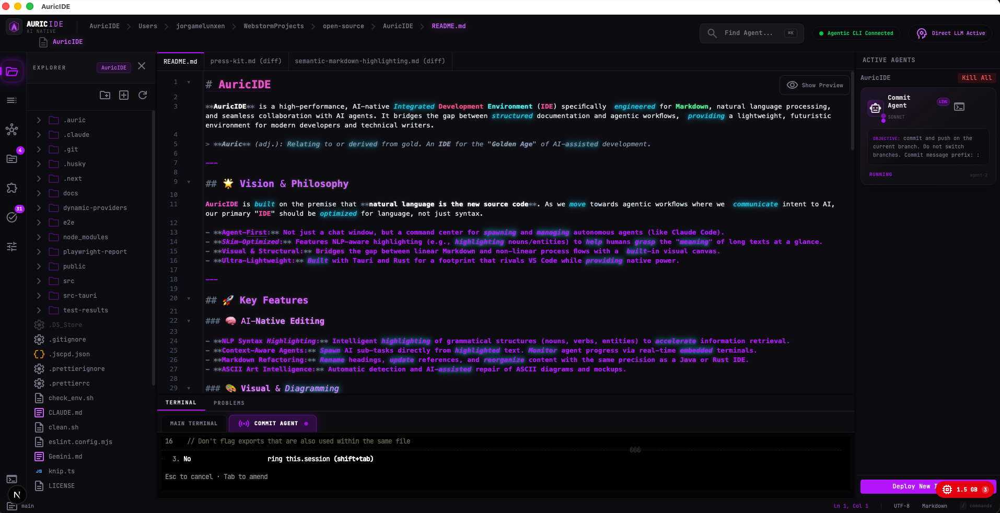

# AuricIDE

> [!WARNING]
> **ALPHA SOFTWARE — NOT PRODUCTION READY**
> This project is in early alpha. Expect breaking changes, missing features, and rough edges. Use at your own risk.

**AuricIDE** is a high-performance, AI-native Integrated Development Environment (IDE) specifically engineered for Markdown, natural language processing, and seamless collaboration with AI agents. It bridges the gap between structured documentation and agentic workflows, providing a lightweight, futuristic environment for modern developers and technical writers.

> **Auric** (adj.): Derived from gold (aurum). An IDE for the "Golden Age" of AI-driven development.



---

## 🌟 Vision & Philosophy

AuricIDE is built on the premise that **natural language is the new source code**. As we move towards agentic workflows where we communicate intent to AI, our primary "IDE" should be optimized for language, not just syntax.

- **Agent-First:** Not just a chat window, but a command center for spawning and managing autonomous agents (like openCode).
- **Skim-Optimized:** Features NLP-aware highlighting (e.g., highlighting nouns/entities) to help humans grasp the "meaning" of long texts at a glance.
- **Visual & Structural:** Bridges the gap between linear Markdown and non-linear process flows with a built-in visual canvas.
- **Ultra-Lightweight:** Built with Tauri and Rust for a footprint that rivals VS Code while providing native power.

---

## 🚀 Key Features

### 🧠 AI-Native Editing

- **NLP Syntax Highlighting:** Intelligent highlighting of grammatical structures (nouns, verbs, entities) to accelerate information retrieval.
- **Context-Aware Agents:** Spawn AI sub-tasks directly from highlighted text. Monitor agent progress via real-time embedded terminals.
- **Markdown Refactoring:** Rename headings, update references, and reorganize content with the same precision as a Java or Rust IDE.
- **ASCII Art Intelligence:** Automatic detection and AI-assisted repair of ASCII diagrams and mockups.

### 🎨 Visual & Diagramming

- **Live Mermaid Integration:** Real-time preview and interactive editing of Mermaid.js diagrams directly within the Markdown flow.
- **Visual Process Canvas:** A node-based editor (`@xyflow/react`) that maps bi-directionally to structured Markdown files—ideal for designing AI workflows.
- **WikiLink Ecosystem:** Full support for `[[WikiLinks]]` with completion, hover previews, and broken link detection.

### 🛠️ Developer-Grade Tooling

- **Integrated Git Control:** File explorer status indicators (A/M/D), gutter markers for line-level changes, and a dedicated source control panel.
- **Professional Terminal:** Full PTY sessions powered by Rust's `portable-pty` and `xterm.js`, allowing for seamless CLI interaction.
- **Slash Commands:** Notion-style `/commands` for rapid inserting of templates, diagrams, and agent prompts.
- **Linter & Processor:** Real-time Markdown linting using `remark` and `unified` to ensure consistent formatting and valid links.

---

## 🛠️ Tech Stack

| Layer                  | Technology                                                                                       |
| :--------------------- | :----------------------------------------------------------------------------------------------- |
| **Desktop Core**       | [Tauri v2](https://tauri.app/) (Rust)                                                            |
| **Frontend Framework** | [Next.js 16](https://nextjs.org/) (App Router), React 19                                         |
| **Editor Engine**      | [CodeMirror 6](https://codemirror.net/)                                                          |
| **Styling**            | [Tailwind CSS 4](https://tailwindcss.com/)                                                       |
| **Visual Canvas**      | [XYFlow](https://xyflow.com/) (React Flow)                                                       |
| **NLP Engine**         | [wink-nlp](https://winkjs.org/), [Transformers.js](https://huggingface.co/docs/transformers.js/) |
| **State Management**   | [Zustand](https://github.com/pmndrs/zustand)                                                     |
| **Terminal**           | [xterm.js](https://xtermjs.org/) + `portable-pty`                                                |

---

## 🏁 Getting Started

### Prerequisites

- **Node.js** >= 20
- **pnpm** >= 8
- **Rust** >= 1.77 (for building the Tauri backend)
- [Tauri Dependencies](https://v2.tauri.app/start/prerequisites/) for your OS.

### Installation & Development

The easiest way to get started is using the provided development scripts:

```bash
# Clone the repository
git clone https://github.com/PlasmaLampe/AuricIDE.git
cd AuricIDE

# Check your environment and start the development server
./run_dev.sh
```

Alternatively, you can run the steps manually:

```bash
# Verify your environment
./check_env.sh

# Install dependencies
pnpm install

# Launch in Development Mode (Full Desktop App)
pnpm tauri:dev

# Run Web-only Preview (Limited native features)
pnpm dev
```

---

## 🧪 Quality Assurance

AuricIDE is built with a focus on reliability and performance.

```bash
pnpm check:all        # Runs Linting, Formatting, Rust/TS Tests, and Clippy
pnpm test             # Run Vitest suite (Frontend)
pnpm tauri:test       # Run Cargo tests (Backend)
pnpm test:e2e         # Run Playwright end-to-end tests
```

---

## 📂 Project Structure

```text
├── src/
│   ├── app/                # Next.js Application (App Router)
│   │   └── components/     # UI Components (Agents, Canvas, Editor, etc.)
│   ├── lib/                # Shared Logic (Editor Extensions, NLP, ASCII Art)
│   ├── types/              # Global TypeScript definitions
│   └── test-setup.ts       # Testing configuration
├── src-tauri/
│   ├── src/                # Rust Backend (Git, PTY, Agents, LLM, CrashLog)
│   └── tauri.conf.json     # Tauri configuration
└── e2e/                    # Playwright E2E tests
```

---

## 📜 License

Licensed under **AGPL v3**. Commercial licensing available on request.
