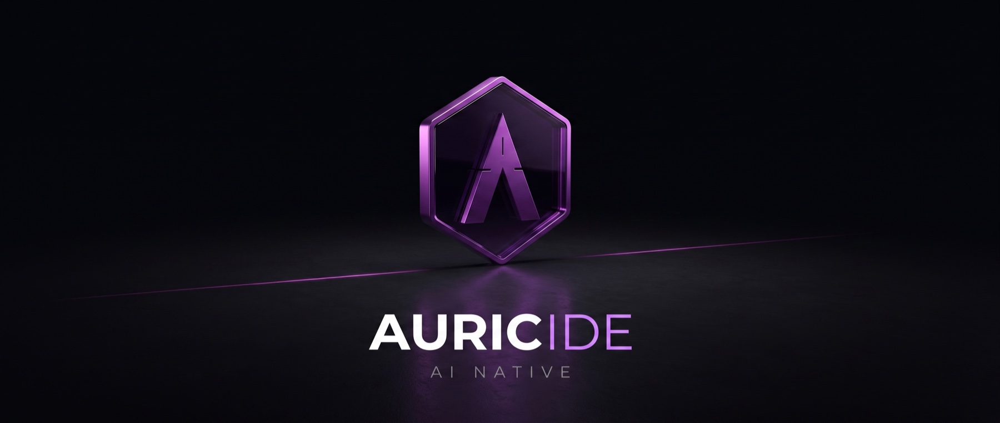
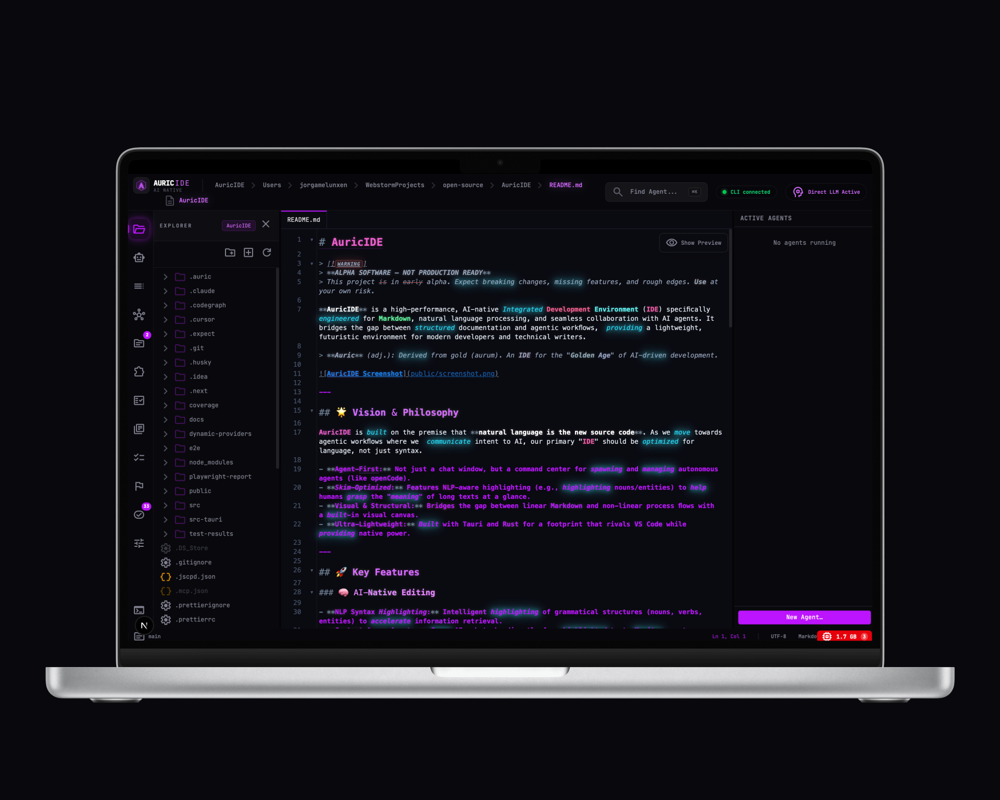

<p align="center">
  
</p>

# AuricIDE

> [!WARNING]
> **Alpha.** Breaking changes, missing features, rough edges. Don't put production work on this yet.

Desktop IDE (Tauri) for Markdown-heavy project work with AI agent orchestration. You define a **goal** with checkable success criteria, hang **tickets** (and optionally requirements) off it, start the **conductor**, and it dispatches agents until the goal is actually satisfied, not until an agent says it is.



---

## Why AuricIDE vs your IDE + AI plugins

A regular IDE with AI plugins is great for _editing with help_. AuricIDE is built for _running work until an outcome is true_.

| Your IDE + AI plugins                             | AuricIDE                                                                      |
| ------------------------------------------------- | ----------------------------------------------------------------------------- |
| One chat / one agent in a sidebar                 | A fleet of real CLI agents, scheduled and watched                             |
| "Done" is whatever the model says                 | Goals with checkable success criteria; conductor only stops when they hold    |
| Tickets live in an external tracker, agents don't | Goals, tickets, requirements, deps are first-class and MCP-shared with agents |
| Plugin = one vendor stack                         | Bring any CLI agent (OpenCode, Crush, …) via `dynamic-providers/`             |
| Code-first workspace                              | Markdown-heavy project workspace: goals, canvases, docs, PM in one shell      |

You still write code. The difference is orchestration: define the outcome, hang work on it, let the conductor dispatch, and get blockers instead of vibes when it isn't satisfied yet.

---

## How the loop works

1. **Goal**: desired outcome + `successCriteria`. Goals form a tree (`parentId`).
2. **Work**: link tickets, attach requirements as gates, or let a planning agent call `decompose_goal` / `create_ticket`.
3. **Conductor**: spawns agents for unblocked open tickets (priority + deps, concurrency cap, max 2 attempts). Tickets marked `needsHumanSupervision` wait for explicit approval.
4. **Done**: `getGoalSatisfaction` requires: subtree tickets `done`, linked requirements `verified`, child goals `achieved`. Otherwise you get the blockers. Empty goals never auto-satisfy.

Epics/tickets stay the backlog view; the goal link is the outcome view. Conductor decisions go into a timestamped log (`conductorDecisions`).

The agent panel is built so you don't have to poll cards: one attention model (`error` > `needs-input` > `stalled`), a real "all quiet" signal while things run, parked agents still running but out of the way. Details live in `src/lib/agents/`.

---

## Features (honest list)

**Goals & conductor**

- Goal tree, ticket links, requirement gates, planning-agent decomposition
- Conductor on ticket events + 15s watchdog; dependency-aware scheduling
- Decision log; opt-in human approval per ticket

**Agents**

- Real child processes over PTY (`portable-pty`), streamed output, real exit codes
- Add whatever custom CLI agent provider you need (OpenCode, Crush, etc.) via JSON under `dynamic-providers/` (no recompile)
- Repo grouping, kill one / kill all, image attach, per-project prompt history
- Permission modes delegated to the underlying CLI flags

**Requirements**

- Long-lived invariants, not tickets: lifecycle `draft → active → implemented → verified → deprecated`
- Stale after 30 days without re-verify; link to test cases; MCP-exposed

**PM**

- Epics / tickets / deps: table, dependency graph (xyflow + dagre), metrics
- Deps actually block conductor scheduling
- Test cases per ticket feed into agent prompts

**Editor / docs**

- CodeMirror 6: Markdown-first, remark-lint, JSON/XML/YAML diagnostics
- NLP highlighting aimed at actionable/factual bits (not rainbow POS tagging)
- WikiLinks, Mermaid widgets (round-trip), mindmaps, Excalidraw embed
- Workflow canvas stored as plain Markdown (`## Node:` …); also Obsidian `.canvas`
- ASCII box-drawing repair for mangled AI diagrams
- Slash commands, blueprint templates

**Git / terminal**

- git2-rs: status, diff, stage, commit, discard; CodeMirror git gutter
- Agentic commit (agent writes message from staged diff)
- Full PTY terminal (xterm.js)
- No in-app branch switch yet (known gap)

**MCP**

- FastMCP server (`src/mcp/server.ts`) over the project SQLite DB
- Goals, epics, tickets, requirements, tests, deps, blueprints, canvas, history
- Same state as the UI/conductor: agents mutate the real project, not a side export

---

## Stack

| Layer        | Tech                                              |
| ------------ | ------------------------------------------------- |
| Shell        | Tauri v2 (Rust)                                   |
| UI           | Next.js 16, React 19, Tailwind 4                  |
| Editor       | CodeMirror 6                                      |
| Canvas       | XYFlow, dagre, Excalidraw                         |
| State        | Zustand                                           |
| DB           | SQLite (`rusqlite` backend, `better-sqlite3` MCP) |
| Terminal     | portable-pty + xterm.js                           |
| Agents / MCP | PTY child processes, FastMCP                      |
| NLP          | wink-nlp, Transformers.js (optional bits)         |

---

## Requirements

- Node.js ≥ 20
- pnpm ≥ 8
- Rust ≥ 1.77
- [Tauri system deps](https://v2.tauri.app/start/prerequisites/) for your OS

---

## Run

```bash
git clone https://github.com/j-amelunxen/AuricIDE.git
cd AuricIDE
./run_dev.sh          # check_env + pnpm install + tauri dev
```

Or step by step:

```bash
./check_env.sh
pnpm install
pnpm tauri:dev        # full desktop app
pnpm dev              # Next only: limited native features
```

---

## Tests & checks

TDD is the house rule (see `CLAUDE.md`). Don't run `pnpm test` in CI/agents: watch mode hangs. Use `test:run`.

```bash
pnpm check:all        # lint, format, knip, jscpd, TS tests, cargo test, clippy, fmt, machete
pnpm test:run         # Vitest once
pnpm tauri:test       # Rust
pnpm tauri:clippy
pnpm test:e2e         # Playwright
pnpm lint
pnpm format:check
```

Single file / name:

```bash
pnpm test:run src/lib/store/pmSlice.test.ts
pnpm test:run -t "epic"
```

---

## Layout

```text
src/
  app/                 # Next App Router UI
  lib/
    store/             # Zustand slices (pm, goals, conductor, agents, …)
    editor/            # CodeMirror extensions
    tauri/             # typed IPC wrappers
    agents/            # fleet, attention, liveness, …
    nlp/ orchestration/ …
  mcp/                 # FastMCP server + tools (one file per domain)
src-tauri/src/         # Rust: DB, agents, git, PTY, LLM, MCP subprocess
e2e/                   # Playwright
dynamic-providers/     # drop-in agent CLI JSON configs
docs/                  # assets, brand, automation surface notes
```

---

## License

**AGPL-3.0-only.** Commercial licensing on request.

---

Driven by: [software-architecture.ai](https://software-architecture.ai)
