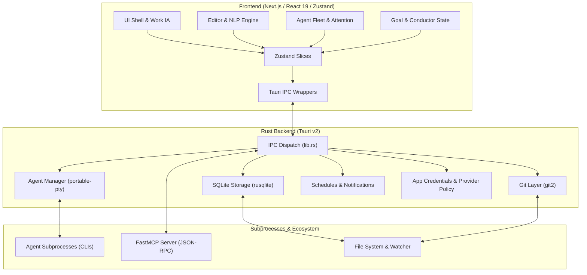

# AuricIDE Specification

AuricIDE is an AI-native desktop IDE built with Next.js 16 (React 19) and Tauri v2 (Rust). It integrates prose editing, local AI agent orchestration, multi-repository Git tracking, goal-driven ticket conductors, and background schedules into a unified desktop environment.

---

## 1. System Overview & Purpose

AuricIDE bridges markdown-driven thinking, project execution, and autonomous AI agents:

- **Editor**: CodeMirror 6 with layered actionable NLP highlights, WikiLinks graph, and linting.
- **Agent Fleet**: Supervised and autonomous execution of external CLI agents (Crush, Claude Code, Gemini CLI, etc.) with real-time PTY streaming, liveness tracking, and an attention model.
- **Goal-Conductor Loop**: Goal satisfaction trees driving unblocked tickets through autonomous conductor agent runs with automated verification criteria.
- **Multi-Repository Git**: Seamless tracking and commits across multiple worktrees and submodules within an opened workspace.
- **Cross-Project Automation**: Cron/one-shot background schedule runner with a notification inbox and safe execution gates.
- **FastMCP Server**: Subprocess exposing repository context, tickets, goals, and notification tools via Model Context Protocol.

---

## 2. Bounded Contexts



---

## 3. Dependency Direction

1. **Frontend to Backend (Downstream commands)**:
   - React components interact strictly through the unified **Zustand store** (`src/lib/store/index.ts`).
   - Store actions trigger asynchronous IPC calls via typed wrappers in [`src/lib/tauri/`](../src/lib/tauri/).
   - Typed wrappers resolve the Tauri bridge through [`src/lib/tauri/invoke.ts`](../src/lib/tauri/invoke.ts).
   - Rust handlers in [`src-tauri/src/lib.rs`](../src-tauri/src/lib.rs) receive the command, unpack arguments via serde, and delegate to backend domain modules (`git.rs`, `database.rs`, `agents.rs`, etc.).

2. **Backend to Frontend (Upstream event streaming)**:
   - Asynchronous events (PTY chunk output, terminal resize, file modification events) are emitted from Rust via `app_handle.emit()`.
   - Frontend listeners subscribe inside `src/app/page.tsx` (`useIDEActions`), buffering and routing stream events directly into terminal instances and Zustand slices.

3. **External Boundary**:
   - Agent CLIs run as isolated OS child processes communicating via PTY pseudo-terminals (`portable-pty`).
   - The FastMCP server runs as a separate Node subprocess communicating via stdio JSON-RPC.
   - Credentials (API keys) are protected at OS level (mode 0600) and never logged or exposed to untrusted payloads.

---

## 4. Runtime Flow

```
[Application Startup]
  │
  ├─ 1. Rust init: open machine credentials (0600), register IPC commands
  ├─ 2. Initialize background schedule runner thread & notification store
  ├─ 3. Mount Next.js webview, reconcile shared preferences (webview-prefs.json)
  └─ 4. Reopen last workspace or present Welcome (Mission Control)
         │
         ▼
[Project Open]
  │
  ├─ 1. Discover Git repositories (root, nested checkouts, submodules)
  ├─ 2. Connect SQLite database (<project>/.auric/project.db) & run migrations
  ├─ 3. Attach file system watcher (notify crate, 500ms debounced polling)
  ├─ 4. Hydrate Zustand store (epics, tickets, goals, requirements, git status)
  └─ 5. Spawn FastMCP server subprocess (stdio) with project DB context
         │
         ▼
[Execution & Collaboration]
  │
  ├─ Editor: CodeMirror 6 with synchronous NLP token marking & async NER
  ├─ Agent Fleet: Launch CLIs in PTY shells, stream stdout, compute liveness & attention
  ├─ Conductor: Autonomous goal fulfillment loop (ticket prioritization → agent dispatch → judge evaluation)
  └─ Background: Schedules trigger notifications; gated execution begins on arrival or click
```

---

## 5. Specification Index

### Architecture & Foundation

- [Architecture Overview](./architecture.md) — Single-screen system diagram and key technological boundaries.
- [Semantic Markdown & NLP Highlighting](./semantic-markdown-highlighting.md) — Multi-layer CodeMirror 6 highlighting architecture.
- [Overlay, Dialog, and Work IA](./actionplan-overlay-flows.md) — Single overlay stack, Work tab unification, and dialog flows.

### Core Modules (`docs/spec/modules/`)

- [Agent Fleet](./spec/modules/agent-fleet.md) — Subprocess PTY management, fleet attention model, and liveness states.
- [Goals & Conductor Loop](./spec/modules/goals-conductor-loop.md) — Goal trees, ticket conductor, judge evaluation, and 4 satisfaction gates.
- [Git Multi-Repo](./spec/modules/git-multirepo.md) — Multi-repository discovery, `repoPath` identity, and ignored repositories.
- [Configuration & Credentials](./spec/modules/configuration-credentials.md) — Global vs project settings, 0600 storage, and provider policies.
- [Notifications & Schedules](./spec/modules/notifications-schedules.md) — Cross-project notification bus, cron schedules, and trust gating.
- [FastMCP Server](./spec/modules/fastmcp-server.md) — Subprocess lifecycle, JSON-RPC communication, and PM/Notification tools.
- [Tauri Backend Core](./spec/modules/tauri-backend-core.md) — Tauri command routing, SQLite persistence, PTY shells, and watcher.
- [GTD Inbox](./spec/modules/inbox.md) — Cross-project captured item triage and ticket conversion.
- [Usage Tracking & Quota](./spec/modules/usage-tracking.md) — Historical transcript token consumption scan vs live CLI quota monitoring.

### Cross-Cutting Flows & Invariants

- [Scheduled Conductor Runs](./design-scheduled-conductor-runs.md) — Timetable project factory and zero-click safety gates.
- [Scheduled Skill Combo Notifications](./design-scheduled-skill-combo-notifications.md) — Scheduled skills and chained combos via notifications.
- [Skill Combo Invariants](./invariants-scheduled-skill-combo.md) — Formal invariants for scheduled skill execution.
