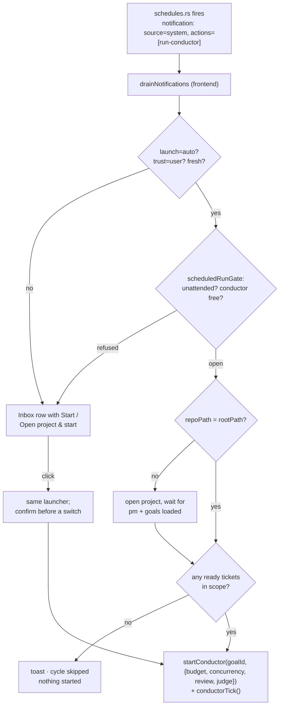

# Scheduled conductor runs — a project factory on a timetable

| Field    | Value                                                                                                                                                                                                         |
| -------- | ------------------------------------------------------------------------------------------------------------------------------------------------------------------------------------------------------------- |
| Date     | 2026-08-17                                                                                                                                                                                                    |
| Status   | Accepted, implemented                                                                                                                                                                                         |
| Audience | Engineers familiar with the notification bus, the schedule runner and `conductorSlice`                                                                                                                        |
| Related  | `docs/design-scheduled-skill-combo-notifications.md`, `src/lib/notifications/`, `src/lib/store/conductorSlice.ts`, `src/lib/conductor/scheduledRun.ts`, `src/app/components/notifications/ScheduleEditor.tsx` |

---

## The idea

"Tuesday, Thursday and Saturday: run the conductor on project A and work five
tickets. Monday, Wednesday and Sunday: the same for project B." A schedule that
does not remind a person to start work but starts the work itself — a project
factory on a timetable, with the human reviewing what came out of it.

Everything needed already exists in pieces: schedules fire (Rust) and raise a
notification; a notification's actions may start agents; the conductor picks
unblocked tickets by priority, spawns implementers, optionally judges the
result. This design joins them with one new action kind and one new conductor
option, and draws a careful line around the one thing that is genuinely new:
**a launch nobody clicked.**

## What is new, exactly

1. **A `run-conductor` notification action.** A schedule payload may now carry
   `{ kind: 'run-conductor', repoPath, ticketBudget, maxConcurrent, goalId?,
requireReview?, launch? }`. Same closed vocabulary, same parser, same trust
   rule as `run-skill`.
2. **A ticket budget on a conductor run.** `startConductor(goalId, options)`
   accepts `{ ticketBudget, maxConcurrent, requireReview }`. With a budget the
   loop stops _starting_ tickets once that many have been spawned in this run,
   lets the ones in flight finish (judge included) and then ends with outcome
   `budget_reached`. Without a budget nothing changes.
3. **`launch: 'auto'`.** A third launch mode next to `dialog` and `direct`. It
   is the only place in the app where a notification arriving is itself the
   click — and it is fenced (below).

## The rules that keep the one click honest — and the zero clicks safe

- **The conductor stays bound to the open project.** It reads `pmDraftTickets`
  and writes through `savePmData(rootPath)`; there is one of it. A scheduled
  run for project B therefore has to _open_ project B. That is not hidden: the
  button on the notification reads "Open project & start" when a different
  project is open, and switching asks first (the same in-app `confirm` the
  agent panel uses), because opening a project closes every tab.
- **Automatic starts only happen in an unattended IDE.** `launch: 'auto'` may
  switch the open project only when all of these hold — one predicate,
  `scheduledRunGate` in `src/lib/conductor/scheduledRun.ts`, and it is the
  only place the rule is written:
  - no agent is `running` or `queued`, and no conductor run is active;
  - no open tab is dirty;
  - the last keyboard/pointer input in the window is at least
    `UNATTENDED_AFTER_MS` (10 minutes) ago;
  - the target project is the open one, **or** no project is open, **or** the
    switch is permitted by the three points above.
- **The dedupe-key format is a contract, not a coincidence.** Rust writes the
  occurrence into the key, the frontend reads it back to judge freshness; both
  are tested against `src/lib/conductor/scheduleDedupeKey.fixtures.json`, so a
  change to `format_ts` cannot quietly turn every automatic start into a button.
- **A refused gate is a button, not a queue.** When the gate refuses, the
  notification simply keeps its Start button and says why in a toast — nothing
  is queued or retried in the background.
- **Only a fresh occurrence starts by itself.** A schedule that came due while
  the app was closed arrives as a catch-up row on the next launch, hours or
  days later. Its occurrence time is in the dedupe key
  (`schedule:<id>:<occurrence>`); if that lies more than
  `AUTO_START_FRESHNESS_MS` (15 minutes) in the past, the notification is a
  button, never a start. Opening the IDE on Wednesday morning must not launch
  Tuesday night's factory into whatever you were about to do.
- **Only a user-authored payload may start anything.** `notificationTrust`
  reads the dispatcher: `system` (schedules) and `ui` are the user's own
  words. From `agent` or `mcp` an identical payload is a button that opens the
  conductor panel — never a start, and a project switch only after the user
  has confirmed it on the click, never on arrival. The MCP
  vocabulary does not carry `run-conductor` at all, so the rule holds at two
  layers, as it does for `run-skill`.
- **A run that is already going is not interrupted.** If a conductor is
  running when the notification arrives, `auto` degrades to the button. Two
  schedules for two projects that overlap in time do not fight; the second
  waits for a human. The same holds for the click: `launchScheduledConductor`
  answers `busy` while a run is active instead of calling `startConductor`,
  which would reset the run's bookkeeping under its live agents — and it
  refuses to switch projects for the same reason.
- **The run announces itself where the click would have.** An automatic start
  writes a decision-log entry (`start`, "Scheduled: <schedule name>"), raises
  the same inbox row and OS banner a manual finish would, and the run summary
  carries the budget ("5 of 5 tickets started"). The window title's agent
  count covers the rest.
- **A cycle with nothing ready is skipped, not started.** The nightly run comes
  round whether or not anyone filed work, so an empty backlog is the ordinary
  case rather than an error. `launchScheduledConductor` counts the scope's
  `ready` tickets — the panel's own preflight, so a schedule and the Start
  button agree on what "there is work" means — and with none it toasts and
  answers `skipped`. Two reasons it is not left to the tick: a run that
  immediately reports itself finished raises a notification nobody needs, and a
  scope holding only blocked or approval-gated tickets never reaches a finished
  state at all — `workLeft` stays true, the run parks, and every later schedule
  refuses behind `conductor-running`. The count happens **after** the load wait;
  before it, a project switch would read an empty backlog and skip every run
  that needed one. `dialog` mode still pre-fills the panel: an empty scope is a
  human's to look at.

## Which settings a run takes from where

| Setting                                 | Comes from                                                                                             |
| --------------------------------------- | ------------------------------------------------------------------------------------------------------ |
| Project                                 | the schedule (`repoPath`)                                                                              |
| Ticket budget, concurrency, review      | the schedule — they belong to _this_ run, not to the project                                           |
| Scope (goal or all tickets)             | the schedule (`goalId`, optional); the goal is read from that project's DB when the schedule is edited |
| Provider                                | the project's conductor provider (`conductorProviderId` in project config), as the panel would use     |
| Model                                   | per ticket from `modelPower`, unless the panel has a session override — same as a manual start         |
| Permission mode of the implementers     | whatever the conductor already uses; the schedule does not widen it                                    |
| Judge form, judge provider, judge model | the schedule when it names them, the project's setting otherwise                                       |

The reason the schedule does not carry the _implementer's_ provider or model:
the conductor's provider is a property of the backlog
(`setConductorProviderId` persists it per project), and a schedule that
overrode it would make Tuesday's run differ from a Thursday click on the same
panel with nothing on either surface showing why.

The **judge** is the exception, and for the reason the judge exists at all: a
reviewer on the implementer's own harness is not an independent second opinion.
So `judgeForm`, `judgeProviderId` and `judgeModel` are selectable in the
Conductor panel (persisted per project, `conductorJudge*` in the project
config) and overridable per schedule. Absent on the action means "the project's
setting" — which is what every schedule saved before these fields existed says,
and what keeps a reminder that is silent about the judge from overwriting a
choice made in the panel. Like `maxConcurrent` and `requireReview`, a
schedule's values are restored in `halt()` when the run ends.

Only the LLM judge form needs the judge API key; a review agent is an agent CLI
like any other. The panel therefore gates the _form_ on the key rather than the
whole switch — gating the switch locked out the one form that would have worked
without a key.

## Ticket budget semantics

- Counts tickets **spawned** in this run (implementer launches), not tickets
  finished. "Work five tickets" is a promise about how much the factory takes
  on, and a judge rejection that re-queues a ticket does not spend a second
  unit — a retry is the same ticket.
- `maxConcurrent` is the existing knob; a schedule sets it for the run
  (default `1`, which is what "in a row" means). It is restored to the previous
  value when the run ends so the panel is not left changed by a schedule.
- With the budget spent and nothing in flight the run ends with
  `outcome: 'budget_reached'`, whether or not the goal has more open work — the
  goal is **not** evaluated for satisfaction on that path, and nothing is
  reported as blocked: the run stopped because it was told to.
- Approval-gated tickets (`needsHumanSupervision`) still queue for approval and
  count against the budget only once actually spawned.

## Data shape

```ts
// src/lib/notifications/types.ts
| {
    id: string; label: string;
    kind: 'run-conductor';
    repoPath: string;
    ticketBudget: number;        // ≥ 1
    maxConcurrent?: number;      // ≥ 1, default 1
    goalId?: string;
    goalName?: string;           // snapshot for the row; the id decides
    requireReview?: boolean;
    judgeForm?: 'llm' | 'agent';  // absent = the project's setting
    judgeProviderId?: string;     // absent = the project's setting
    judgeModel?: string;          // absent = the project's setting
    launch?: 'auto' | 'direct' | 'dialog';   // absent = dialog
  }
```

`dialog` for this kind means "open the Conductor panel with the run
pre-configured, human presses Start"; `direct` starts on the click; `auto`
starts on arrival within the gate. The MCP schema does not list the kind.

```ts
// src/lib/store/conductorSlice.ts
startConductor(goalId: string | null, options?: {
  ticketBudget?: number;
  maxConcurrent?: number;
  requireReview?: boolean;
  judgeForm?: 'llm' | 'agent';       // restored in halt(), like the two above
  judgeProviderId?: string | null;
  judgeModel?: string | null;
  origin?: string;             // e.g. the schedule name, for the decision log
}): void;
conductorTicketBudget: number | null;
conductorRunSpawned: number;
ConductorRunSummary.outcome: … | 'budget_reached';
ConductorRunSummary.ticketBudget: number | null;
```

## Flow



## Out of scope, deliberately

- A conductor that runs against a project that is not open. That is the real
  multi-project factory and it is a rewrite of the slice into a per-project
  engine; this design gets the timetable working with the conductor as it is
  and leaves the door open (`scheduledRun.ts` is the only caller that would
  change).
- Rust changes. The runner copies actions through unchanged, as it does for
  every other kind.
- The implementer's provider/model per schedule (see above). The judge's is
  deliberately not out of scope — see the same section for why.
