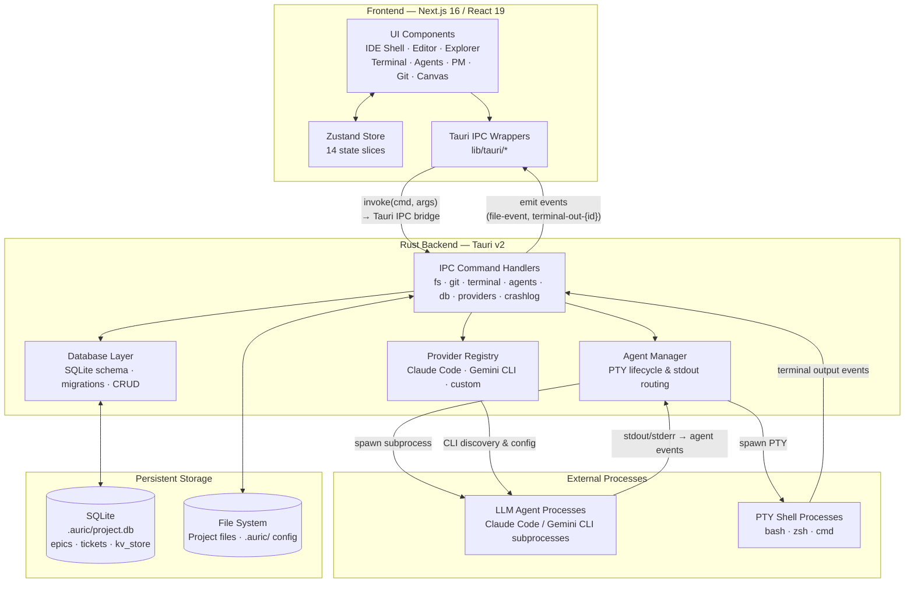

# AuricIDE – Component & Module Diagram

## Key Boundaries

| Boundary           | Technology                                 |
| ------------------ | ------------------------------------------ |
| Frontend ↔ Rust    | Tauri v2 IPC (`invoke` + event emitter)    |
| Rust ↔ LLM Agents  | OS subprocess with PTY (stdout/stderr)     |
| Rust ↔ Shells      | `portable-pty` cross-platform PTY          |
| Rust ↔ SQLite      | `rusqlite` via `.auric/project.db`         |
| Rust ↔ File System | `std::fs` + `notify` watcher (500 ms poll) |

## Data Flow Summary

1. **User action** → UI Component → Zustand Store update or IPC call
2. **IPC call** → Tauri bridge → Rust command handler
3. **File/Git ops** → File System read/write
4. **Agent spawn** → Provider Registry selects CLI → Agent Manager forks subprocess → stdout events stream back to Frontend via Tauri events
5. **PM data** → `pm_save` / `pm_load` commands → SQLite epics/tickets tables
6. **Terminal I/O** → `shell_write` command → PTY Shell → `terminal-out-{id}` event → TerminalPanel (xterm.js)
